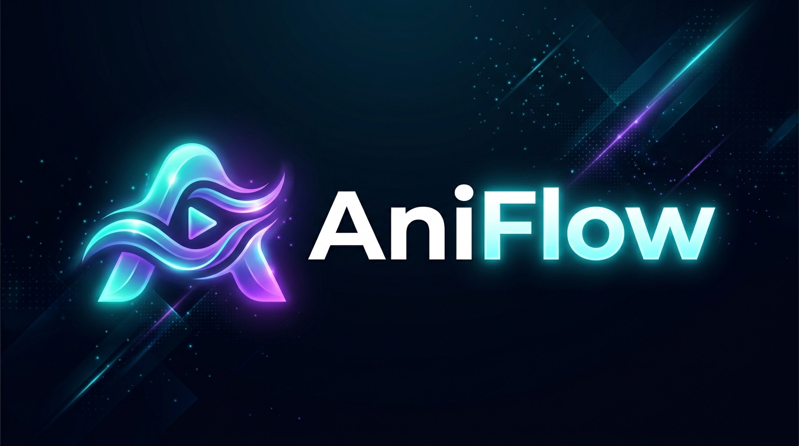

<p align="center">
  
</p>

# AniFlow

> **Advanced Anime Discovery, Release Intelligence, Download Management, Library, Playback, Automation & Media Organization for Android.**

[](https://github.com/ahmedabbas358/Nyaa-App/actions/workflows/ci.yml)
[](https://github.com/ahmedabbas358/Nyaa-App/actions/workflows/release.yml)
[](LICENSE)
[](https://kotlinlang.org)
[](https://developer.android.com)

*Repository: [ahmedabbas358/Nyaa-App](https://github.com/ahmedabbas358/Nyaa-App)*  
*Application Package: `com.aniflow.app`*

---

## 🌟 Overview

**AniFlow** is an Android-native media platform designed for anime discovery, release intelligence, multi-connection download management, and private offline library playback.

The user interface combines:
* **Apple App Store**: Editorial media presentation, 2:3 posters, 16:9 thumbnails, and restrained typography.
* **YouTube**: Frictionless content browsing, carousels, scrubbing, and familiar playback controls.
* **Telegram**: Compact, high-density metadata rows and fast contextual action sheets.
* **Linear**: Restrained color tokens, keyboard shortcuts (`Ctrl + K`), and clean hierarchy.
* **Notion & Stripe**: Structured settings grouping and transparent system diagnostics.

```text
Discovery & Search (Nyaa Provider)
        ↓
Title Intelligence & Semantic Tagging (Resolution, Codec, Audio, Subs)
        ↓
Hierarchical Grouping (Anime → Season → Episode Mapping)
        ↓
Profile-Driven Quality Selection (Balanced, High Quality, Small Size, Archive, Custom)
        ↓
Safety Gate (Pre-flight Disk Check, Reserve Protection & Conflict Policy)
        ↓
Download Orchestration (Persistent Queue → Multi-Segment HTTP & Torrent Engines)
        ↓
Verification & Atomic Storage Organization (.part staging → SAF Destination)
        ↓
Library Indexing & Local Media3 Playback (Watch Progress, Up Next, Subtitle Styling)
        ↓
Autonomous Monitoring (Rules, Triggers & Background Execution History)
```

---

## 📸 Screenshots

| Home & Discover | Universal Search | Download Manager |
| :---: | :---: | :---: |
|  |  |  |

| Media Player | Quality Profiles | Rule Automation |
| :---: | :---: | :---: |
|  |  |  |

*(Place screenshots under `docs/images/`)*

---

## 🚀 Key Capabilities

### Implemented
- [x] **Universal & Local Search**: Integrated search coordinator uniting local FTS with provider queries, real-time entity suggestions, filter chips, and AST query builder.
- [x] **Release Intelligence**: Rule-based parser resolving anime title, season, episode, resolution (1080p, 720p, 4K), codec (HEVC, AV1, H.264), audio, subtitles, and release group with confidence scoring.
- [x] **Release Comparison**: Fact-based side-by-side comparison matrix of video, audio, seeds, peers, and file sizes.
- [x] **Professional Download Manager**: 6-tab monitoring dashboard (`Overview`, `Files`, `Connections`, `Speed Limits`, `Metadata`, `Logs`), multi-segment HTTP chunking, torrent swarm tracking, and persistent queue state.
- [x] **Local-First Library**: Media categories (`All`, `Anime`, `Movies`, `Continue`, `Upgrades`, `Duplicates`, `Unidentified`), duplicate resolution, and manual file mapping.
- [x] **Media3 Video Player**: Gestures for seek and scrubbing, subtitle styling presets (size, color, background, outline), audio track picker, and auto-next episode prompt.
- [x] **Quality Profiles & Preferences**: 5 preset templates (`Balanced`, `High Quality`, `Small Size`, `Archive`, `Mobile`) with granular hard/soft preference controls.
- [x] **Automation & Visual Rule Builder**: Conditional `WHEN / IF / THEN` execution engine, dry-run simulation with checkmarks, and global automation kill-switch.
- [x] **Storage & Safety**: Scoped Storage & Storage Access Framework (SAF) integration with atomic `.part` file moves and low-space auto-pause threshold.
- [x] **Responsive & Accessible**: Dynamic adaptation for Compact Phones (<600dp) and Expanded Tablets (≥600dp) with Navigation Rail, physical keyboard shortcut (`Ctrl + K`), and full Arabic RTL layout mirroring.

### In Progress / Roadmap
- [ ] Direct tracker scraping metrics optimization
- [ ] External subtitle file side-loading (`.srt` / `.ass` importer)
- [ ] Network-attached storage (SMB / WebDAV) integration

---

## 📐 Architecture & Module Structure

AniFlow strictly enforces **Clean Architecture** with unidirectional data flow:
$$\text{UI / Composable} \longrightarrow \text{ViewModel} \longrightarrow \text{Use Case} \longrightarrow \text{Domain Contract} \longrightarrow \text{Repository} \longrightarrow \text{Infrastructure}$$

```text
Nyaa-App/
├── app/                  # Application composition root, Navigation & AppShell
├── build-logic/          # Gradle convention plugins (Composite build)
├── core/
│   ├── common/           # Pure utilities, typed IDs, PathSanitizer
│   ├── ui/               # AniDesignSystem, DesignTokens, Theme, and Previews
│   ├── database/         # Room Database, DAOs, Entities, TypeConverters
│   ├── logging/          # SecureLogger with automatic LogRedactor
│   ├── network/          # OkHttp, RequestLimiter, ProviderCircuitBreaker
│   └── storage/          # Scoped storage & SAF management
├── domain/               # Pure Kotlin/JVM business domain (Zero Android imports)
├── data/                 # Repository implementations & caching
├── provider/
│   ├── core/             # Provider interfaces & SearchCoordinator
│   └── nyaa/             # Nyaa adapter, HTTP client, HTML/RSS parsers
├── download/
│   ├── core/             # State machine, queue, scheduler, reservation manager
│   ├── http/             # Chunked multi-connection HTTP engine
│   ├── torrent/          # Torrent runtime engine abstraction
│   └── service/          # Android foreground execution service
├── platform/             # Scoped notifications, sharing, Media3 player
├── feature/              # Presentation modules (Home, Search, Downloads, Library, etc.)
└── testing/              # Regression, fuzz, chaos, and acceptance test suites
```

---

## 🛠️ Build & Installation Instructions

### Prerequisites
- **JDK 17** (Eclipse Temurin 17 recommended)
- **Android SDK**: Build Tools `35.0.0`, Platform SDK `35`, Min SDK `26` (Android 8.0+)
- **Gradle**: Wrapper provided (`8.9+`)

### Build Commands
```bash
# Clone the repository
git clone https://github.com/ahmedabbas358/Nyaa-App.git
cd Nyaa-App

# Run unit tests
./gradlew test                  # Linux / macOS
.\gradlew.bat test              # Windows

# Run architecture & quality gate checks
./scripts/check.sh              # Linux / macOS
.\scripts\check.ps1             # Windows

# Assemble Debug APK
./gradlew assembleDebug

# Assemble Signed Production Release
./scripts/build-release.sh      # Linux / macOS
.\scripts\build-release.ps1     # Windows
```

---

## 📦 Official Release & Verification

Production release binaries are published under [Releases](https://github.com/ahmedabbas358/Nyaa-App/releases):
* `AniFlow-v1.0.0.apk`: Standalone application installer
* `AniFlow-v1.0.0.aab`: Android App Bundle for store distribution
* `AniFlow-v1.0.0.apk.sha256`: SHA-256 integrity checksum

To verify an APK before sideloading:
```bash
sha256sum -c AniFlow-v1.0.0.apk.sha256
```

---

## 🔒 Privacy & Permissions

* **100% Local-First**: Search history, quality profiles, watch progress, and library metadata remain strictly on your device.
* **No Cloud Telemetry**: Zero analytics trackers, advertising SDKs, or background telemetry.
* **Storage Access Framework (SAF)**: AniFlow requests access only to user-selected media folders.
* **Foreground Service**: Used exclusively while downloading to prevent OS termination.

---

## ⚠️ Third-Party Provider & Content Disclaimer

* **External Provider Notice**: AniFlow is a client software tool that interfaces with user-specified third-party providers (such as Nyaa.si). The authors of AniFlow do not host, operate, control, or own any external indexing providers or torrent swarms.
* **Content Disclaimer**: AniFlow does not distribute or bundle copyrighted media. Users are solely responsible for ensuring that their downloading and media consumption activities comply with applicable laws in their jurisdiction.

---

## 🤝 Contributing

Contributions are welcome! Please read:
* [Contributing Guidelines](CONTRIBUTING.md)
* [Code of Conduct](CODE_OF_CONDUCT.md)
* [Security Policy](SECURITY.md)
* [Release Operations Guide](docs/release.md)

---

## 📄 License

AniFlow is licensed under the [MIT License](LICENSE).  
Third-party notices and licenses are documented in [THIRD-PARTY-NOTICES](THIRD-PARTY-NOTICES).
>>>>>>> da755ba (docs: prepare project documentation and release operations)
